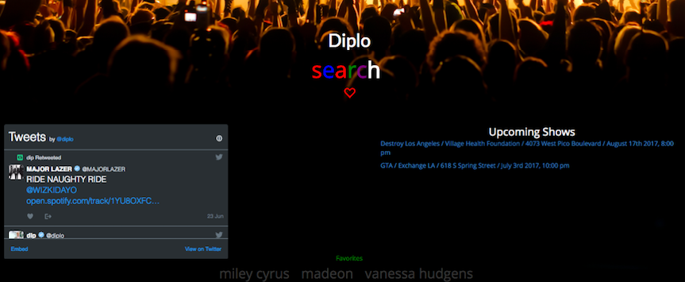

# Music++

Music++ creates a one-stop shop for all of a music lover's needs. No need to jump between apps, search for your favorite artist and Music++ offers one central hub for upcoming concerts, bio, top songs, and tweets. Save your favorite artists for easy access.

## Getting Started

These instructions will get you a copy of the project up and running on your local machine for development and testing purposes. See deployment for notes on how to deploy the project on a live system.

### Installing

-npm install

node server.js

### Landing Page

### Results View

## Deployment
deployed on github - [Music++](https://kikanga.github.io/Artist-Direct/)

## Built With

* [JavaScript](https://www.javascript.com/)
* [Bootstrap](getbootstrap.com) - CSS framework
* [Spotify](https://developer.spotify.com/web-api/) - API used top songs
* [Songkick API](http://www.songkick.com/developer) - API used for concert information
* [Firebase](http://firebase.google.com/) - Database for user login

## Authors

* **Ana Brown** - [Ana-ACLA](https://github.com/Ana-ACLA)
* **Paige Pittman** - [paigepittman](https://github.com/paigepittman)
* **Vincent Ajanwachuku** - [thisiswhale](https://github.com/kikanga)
* **Zihao Li** - [kodakyellow](https://github.com/kodakyellow)

See also the list of [contributors](https://github.com/Capitol-Hill/Capitol-Hill/graphs/contributors) who participated in this project.
